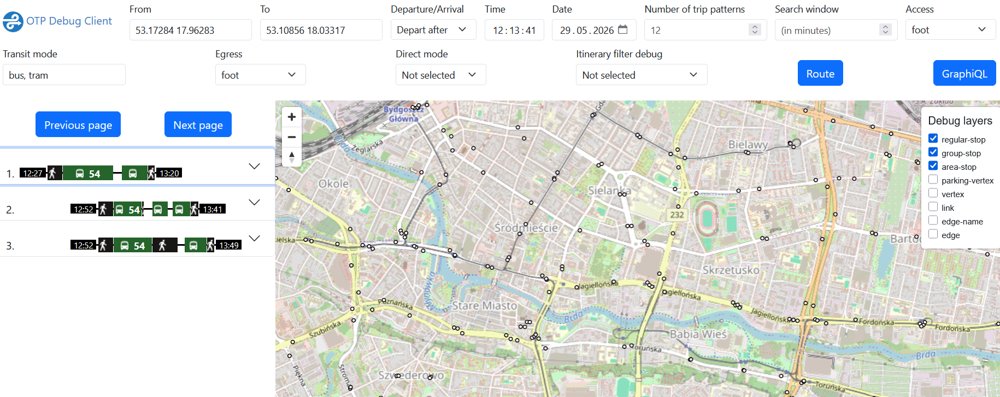

# Public Transport Planner

This repository contains helper scripts for downloading transit data and running OpenTripPlanner locally.

## Prerequisites

Run the scripts from the repository root.

You will need:

- A Unix-like shell such as WSL, Git Bash, or a Linux/macOS terminal
- curl
- Java JDK version 21 (required by OpenTripPlanner) 
- A reasonable amount of RAM; the graph build uses `-Xmx2G`

If you are using Windows PowerShell, start the scripts from WSL or Git Bash.

## Make the scripts executable

```bash
chmod +x scripts/download_gtfs.sh scripts/run_ots.sh
```

## Download the GTFS feed

```bash
./scripts/download_gtfs.sh
```

This downloads the latest GTFS archive and saves it to:

- `data/gtfs.zip`

## Start OpenTripPlanner

```bash
./scripts/run_ots.sh
```

This script will:

1. Download OpenTripPlanner 2.6.0 if it is not already present
2. Download the Kujawsko-Pomorskie OSM extract if it is missing
3. Build the route graph into `data/graph.obj` if needed
4. Start the OTP server

After startup, open:

- http://localhost:8080

## Notes

- To force a graph rebuild, remove `data/graph.obj` and run the script again.
- Stop the server with `Ctrl+C`.
- If the GTFS file is missing, the OTP script will stop and ask you to place it in `data/gtfs.zip`.

## Trip planning

Use following configuration for trip planning:



**IMPORTANT**
Check for the available dates in calendar_dates.txt inside .gtfs if you see no trips are available.

